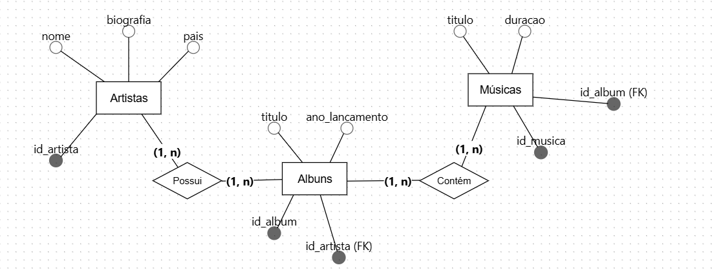
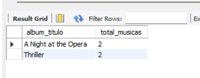
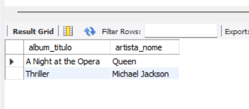
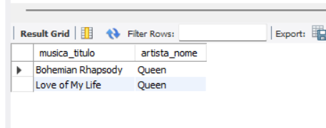

# Projeto-plataforma_musica

## Descrição do projeto
#### Este projeto envolve a criação de um banco de dados relacional para uma plataforma de música online simples. A ideia é modelar, implementar e gerenciar dados sobre artistas, álbuns e músicas, garantindo que todos os requisitos de um projeto de banco de dados sejam atendidos.

## Modelagem do Banco de Dados

### Modelo conceitual

#### O diagrama modelado a seguir mostra a estrutura conceitual do banco de dados, destacando as entidades e os relacionamentos que existem entre elas.

#### *Entidades*: artistas, albuns, musicas

#### *Relacionamentos*:
- Um *artista* lança N *album*.
- Um *album* contém N *musicas*.

### Modelo lógico e físico

#### Com base do modelo conceitual, foram definidas as tabelas, chaves primárias e estrangeiras.

Artistas: id_artista (PK), nome, biografia, pais.

Albuns: id_album (PK), titulo, ano_lancamento, id_artista (FK).

Musicas: id_musica (PK), titulo, duracao, id_album (FK).

## Exemplos de consultas
- Contar o número de músicas em cada álbum.

- Encontrar músicas de artistas. 

- Encontrar todas as músicas de um artista específico.

